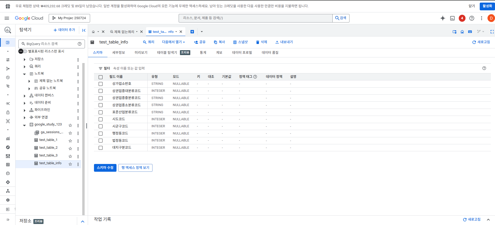

# BigQuery × Google Sheets 실시간 시각화 실습

이 프로젝트는 Google Cloud Platform의 BigQuery와 Google Sheets를 연동하여  
직접 SQL 쿼리를 작성하고, 데이터를 시각화하는 전 과정을 기록한 실습입니다.

---

## 🔧 1. 테이블 생성

- employees 테이블 생성 쿼리  

- departments 테이블 생성 쿼리  

---

## 📡 2. Google Sheets 연동

- SyncWith를 활용한 BigQuery → Google Sheets 연동  

---

## 📊 3. 데이터 시각화 결과

- name 기준 Pie Chart 시각화  

---

## 📌 실습 요약

- BigQuery에서 SQL 작성 및 테이블 구성  
- Google Sheets와 실시간 연동  
- SQL 기반 시각화 대시보드 구현 가능성 실습
